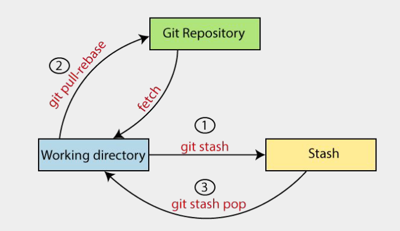

# Lesson 7
## Git
### Git Stash

- Stash: lưu các công việc đang làm lại vào 1 vùng nhớ “tạm”
- Unstash: Lấy các công việc trong vùng nhớ tạm ra
- Câu lệnh (cho file đã vào vùng repo): 
git stash
- Câu lệnh (cho file chưa vào vùng repo - file mới tạo, chỉ đang ở Local):
git stash save --all
- Câu lệnh unstash: 
git stash pop
- Lưu ý: nên pull code mới về trước khi stash (hạn chế conflict)

## JavaScript (Advance Functions & DOM & Advance Methods)
### Lambda function (Arrow function)
- Một cách ngắn gọn viết hàm trong JS.
- Sử dụng dấu => thay vì từ khoá function
- Cú pháp:
(parameters) => {
// Code here
}

### Anonymous functions
- Hàm không có tên
- Thường được sử dụng 1 lần hoặc làm đối số truyền vào các hàm khác
- Cú pháp:
function (parameters) {
// Code here
}

### DOM: relation
- self: node hiện tại
- parent: cha - là node phía trên trực tiếp của node hiện tại
- children: con - là node phía dưới trực tiếp của node hiện tại
- ancestor: tổ tiên - là các node:
    + (1) cha
    + (2) cha của (1)
    + (3) cha của (2)
- descendant: hậu duệ - là các node con, cháu, chắt, ...
- sibling: anh em - Là những phần tử cùng cấp và cùng cha
- following: theo sau - Gồm các node ở phía bên tay phải của node hiện tại
- preceding: phía trước - Gồm các node ở phía bên tay trái của node hiện tại, trừ các node ancestor
- following-sibling: anh em phía sau = following + sibling
- preceding-sibling: anh em phía trước = preceding + sibling

### Xpath
- wildcard: *
- chứa thuộc tính
- and và or
- innerText: text()
- normalize-space()
- contains
- starts-with
- not
- Example: 
    //form[@id='registrationForm']

    //input[@type="text" and @name="username"]
    //button[@id="submit" or @class="btn-primary"]

    //p[text()='Cộng đồng Playwright Việt Nam với hơn 20K members']//ancestor::*

    //h1[normalize-space(text())="Chào mừng"]

    //a[contains(text(), "Xem thêm")]
    //div[contains(@class, "active")]

    //input[starts-with(@id, "user_")]

    //input[not(@disabled)]

### Xpath Axes
- parent
- child
- ancestor
- descendant
- following
- preceding
- following-sibling
- preceding-sibling

